CHERRY CAKE · QUANT RESEARCH

# 车厘子蛋糕量化系统机器人

网址：[www.cherrycake.cc](https://www.cherrycake.cc)

## 量化研究工作台｜产品与技术全览

车厘子蛋糕机器人是一套面向真实 A 股与美股指数研究的量化研究产品。产品将行情采集、盘面观察、盘后复盘、指标机器人、智能选股、个股深挖、资讯研报、AI 研判和历史验证组织为一条连续工作流，并同时提供 Web 端与 Windows 桌面端。

> 这是公开的产品展览，不包含业务源码、数据库、密钥、真实交易账户或生产配置。网站只提供研究与模拟记录，不执行真实下单；截图是历史界面示例，不代表实时行情。

**阅读目录**

- [产品定位与组成](#chapter-01)
- [产品能力与工程构成](#chapter-02)
- [技术架构与产品落地](#chapter-03)
- [产品界面概览](#chapter-04)
- [四个产品域串联](#chapter-05)
- [AI 助手｜贯穿各个领域的智能层](#chapter-06)
- [指标引擎与评分系统｜从源码研究到产品信号](#chapter-07)
- [核心入口与功能说明](#chapter-08)
- [工作台｜四个阶段与公共组件](#chapter-09)
- [A 股复盘中心｜十个分页与跨日闭环](#chapter-10)
- [完整功能模块](#chapter-11)
- [指标机器人](#chapter-12)
- [QQQ 量化决策台](#chapter-13)
- [板块中心](#chapter-14)
- [排行榜](#chapter-15)
- [智能选股](#chapter-16)
- [AI 研判页面](#chapter-17)
- [异动中心](#chapter-18)
- [个股研究](#chapter-19)
- [PEG 估值](#chapter-20)
- [市场简报](#chapter-21)
- [资讯雷达](#chapter-22)
- [产业信号](#chapter-23)
- [资讯榜单](#chapter-24)
- [实时动态](#chapter-25)
- [研报中心](#chapter-26)
- [自选中心](#chapter-27)
- [模拟交易](#chapter-28)
- [回测中心](#chapter-29)
- [信号质量](#chapter-30)
- [数据源与运行状态](#chapter-31)
- [附录｜原展示首页的完整阅读入口](#chapter-32)

## 产品定位与组成

产品由四个层级组成：市场观察层呈现“现在发生了什么”；研究与 AI 层回答“为什么、怎样验证”；模拟、回测与质量层复核判断在历史样本中的表现；账号、数据源、权限与桌面运行层保障系统可使用、可恢复、可维护。

## 产品能力与工程构成

| 功能分支 | 构成 | 技术栈与实现重点 |
| --- | --- | --- |
| 前端页面 | HTML、CSS、原生 JavaScript、ECharts | 多页面工作台、K 线、热力图、筛选和响应式布局。 |
| 服务端 | Python、FastAPI、Uvicorn | 业务 API、权限、研究任务、数据聚合和状态返回。 |
| 数据处理 | pandas、NumPy、openpyxl | 交易日对齐、指标计算、统计分组与表格导出。 |
| 持久化 | SQLAlchemy、SQLite | 账号、自选、研究记录、筛选条件、验证结果和任务状态。 |
| 行情与资料 | Futu OpenAPI、AKShare、Baostock、requests、pypdf | 行情、历史资料、研报 PDF 分页读取和来源状态。 |
| 安全与部署 | cryptography、服务端授权、HTTPS、Cloudflare Tunnel | 账号密钥隔离和公网到实际运行节点的安全转发。 |

## 技术架构与产品落地

技术架构围绕真实研究流程组织：Agent 层负责页面上下文、意图路由、白名单工具、事实封存、阶段任务、失败终态和任务恢复；业务层负责指标口径、研究流程、权限与审计；数据层负责多源接入、缓存、持久化和时间状态；交互与交付层负责 Web 页面、桌面运行、响应式体验和测试守门。每项技术都对应明确的产品能力。

### 核心技术组件与应用场景

| 技术能力 | 落地功能 | 为什么需要它 |
| --- | --- | --- |
| FastAPI / Starlette / Uvicorn | 工作台聚合、机器人、复盘、板块、资讯、AI 任务、账号和数据状态 API | 把不同速度、不同来源的业务统一成可查询、可降级的服务。 |
| SQLAlchemy 2.0 / SQLite | 账号、自选、策略、研究归档、任务、事实快照、竞价记录和信号历史 | 页面刷新或服务重启后，研究状态和证据仍可恢复。 |
| 自研 Agent 编排 | 普通问答、自然语言选股、七阶段个股深挖、研报解释和任务通知 | 让模型在受控事实和工具上工作，并且能显示阶段、成本、失败和恢复。 |
| pandas / NumPy | 交易日对齐、指标计算、复盘横截面、竞价时点、PEG、质量统计和回测 | 时间序列必须在同一日期、周期和缺失口径下比较。 |
| Futu OpenD / AKShare / Baostock / 专题适配器 | 实时行情、历史 K 线、财务、板块、资讯和离线补充 | 不同数据源各自有覆盖与授权边界，需要显式路由和状态。 |
| 原生 JavaScript / ECharts | K 线、热力图、连板梯队、排行榜、筛选器、任务进度和移动端布局 | 高密度研究页面需要快速交互、局部刷新和可视化证据。 |
| cryptography / 会话与同源保护 | BYOK 密钥、登录、邀请、站长授权、三路模型和跨站写入防护 | 模型密钥、管理员能力和普通账号必须真正隔离。 |
| Tauri / PyInstaller | Windows 桌面启动器、本机 WorkBuddy、服务 sidecar 和安装包 | 把网页研究系统变成用户可以安装、启动和诊断的桌面产品。 |
| pytest 与架构守门 | 指标、回测、AI、数据源、权限、页面契约和移动端回归 | 把“不伪造数据、不泄漏权限、不把失败当成功”等规则变成可执行验收。 |

### 技术组件如何协同

数据采集与缓存为工作台、复盘和研究页面提供统一事实；指标引擎输出确定性评分与信号；Agent 编排在授权边界内完成意图识别、工具调用和长任务恢复；前端将来源、时间、缺失和失败状态与结果同时呈现。这些组件共同支撑不同入口之间的连续使用。

## 产品界面概览

### 核心入口与功能分布

以下截图先展示产品的主要使用场景；后文再按产品模块展开用途、功能关系、使用方式和技术落点。截图标题与正文入口保持对应，便于从界面直接进入说明。

### 产品首页｜研究总览与入口

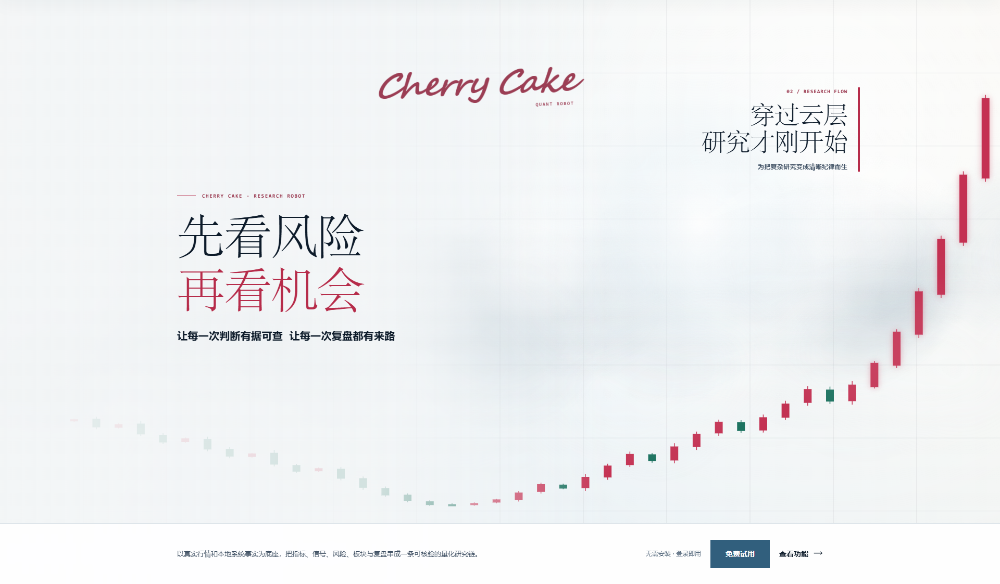

### 工作台｜日内研究总览

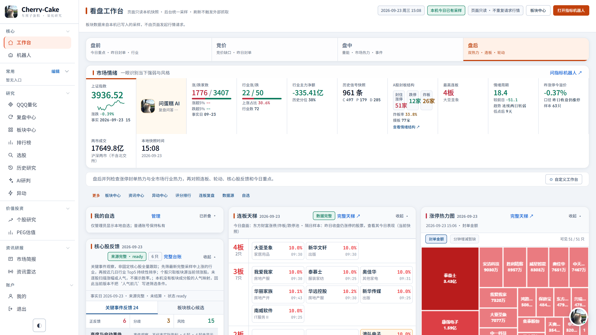

### 指标机器人｜指标图表与信号

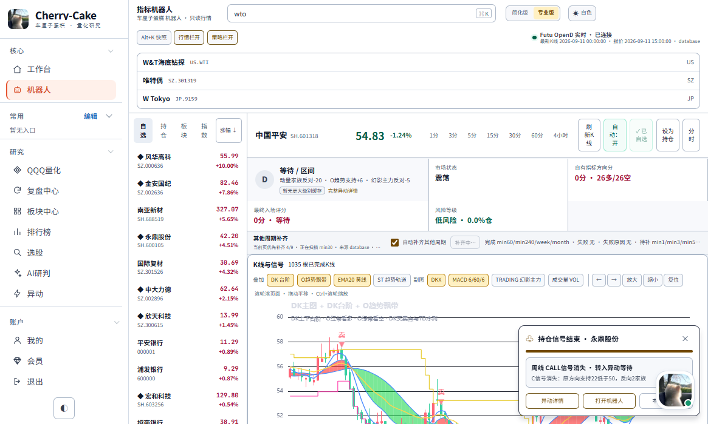

### A 股复盘中心｜复盘看板

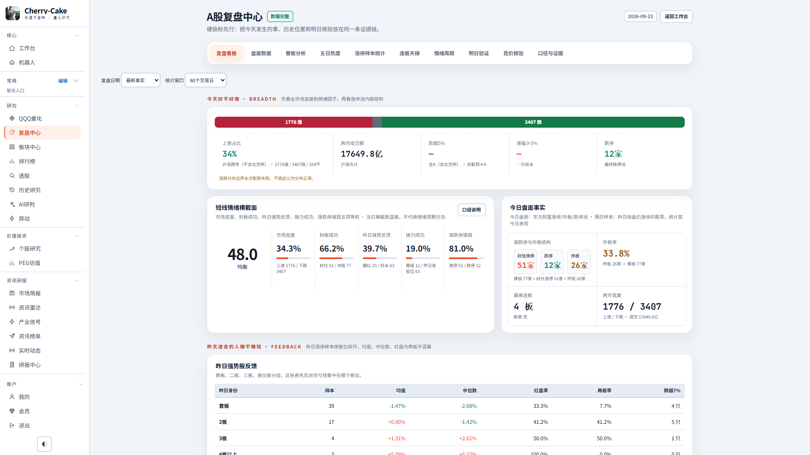

### 历史研究｜研究记录

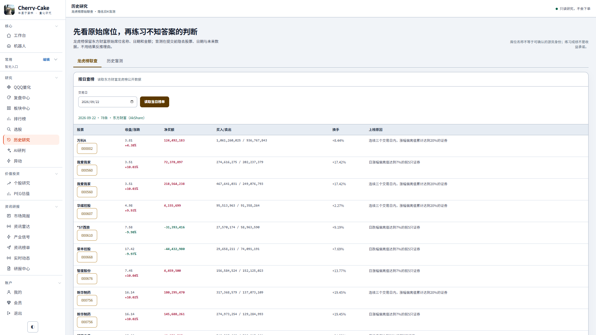

## 四个产品域串联

| 产品域 | 核心模块 | 关系 |
| --- | --- | --- |
| 市场观察 | 工作台、A 股复盘中心、板块中心、排行榜、异动中心、指数与海外（QQQ） | 先建立市场背景，再把宽度、板块、排行和异动缩小到可研究的对象。 |
| 信号与研究 | 指标机器人、智能选股、个股研究、PEG 估值、历史研究 | 把对象变成条件、信号、估值和命题，输出可解释的研究问题。 |
| 资讯与验证 | 市场简报、资讯雷达、产业信号、资讯榜单、实时动态、研报中心、自选、模拟、回测、质量 | 补充外部证据，并检查一个判断在历史和模拟环境中是否站得住。 |
| AI 与平台 | AI 助手、模型路由、账号权限、数据源、管理后台、桌面交付 | AI 贯穿上述域；平台层负责密钥、任务、数据状态和跨设备可用性。 |

## AI 助手｜贯穿各个领域的智能层

AI 助手是产品的一层能力，不等于“AI 研判”一个页面。它在工作台、指标机器人、复盘中心、选股、个股研究、资讯研报和任务通知中以不同深度出现：简单问题直接引用系统事实，复杂问题才启动有阶段、有工具、有状态的研究任务。

### 从即时问答到研究任务

先接收页面上下文和用户意图，再决定是事实查询、解释、筛选还是完整研究。

只调用白名单工具读取行情、板块、指标、财务、公告或已有研究记录；工具结果先形成事实包，模型不能自行补写价格和评分。

复杂研究进入任务队列，按阶段推进并保存进度、事件、证据、失败原因和可恢复状态。

回答带有数据时间、来源和边界；模型不可用时显示真实失败或回退结果，不把空结果包装成成功。

| 领域 | 用户看到的 AI 交互 | 确定性部分与 Agent 部分 | 界面示例 |
| --- | --- | --- | --- |
| 工作台 | 询问“今天先看什么”、解释市场宽度和盘前状态。 | 市场统计由后端计算；AI 负责把事实组织成阅读顺序和风险提示。 | AI-02｜工作台助手 |
| 指标机器人 / QQQ | 询问信号、四家族评分、周期共振和指标怎么用。 | 指标与评分由引擎产生；AI 读取快照并解释，不创造信号。 | AI-01 / ROBOT-01 |
| A 股复盘 / 竞价 | 根据事实询问情绪、连板、竞价兑现和明日验证。 | 复盘统计与时点采集确定；AI 负责归纳、对照和提出复核问题。 | AI-03 / WB-AUC-01 |
| 智能选股 | 用口语描述策略、主题或板块条件。 | 意图解析和条件审核由 AI 辅助；最终候选必须经过白名单字段和确定性筛选。 | AI-04｜自然语言选股 |
| 个股研究 | 启动七阶段深挖，查看结论、证据缺口和风险。 | 行情、财务和公告先封存；Agent 分阶段生成七个结果区并轮询状态。 | AI-05｜研究任务 |
| 资讯 / 研报 / PEG | 要求解释资料、指标口径或缺失原因。 | 资料来源、字段完整性和 PEG 计算确定；AI 只做有来源的解释。 | AI-06｜资料解释 |
| 全局助手与通知 | 在页面底部继续追问，或从任务完成通知返回结果。 | shell.js 轮询任务状态；助手沿用当前账号、页面和模型路由。 | AI-07｜任务通知 |

## 指标引擎与评分系统｜从源码研究到产品信号

指标机器人采用“源码研究 → 数值核验 → 生产适配 → 家族评分 → 生命周期 → 质量评估”的工程链。指标源码工作区保留 dk 主图、MACD、MACDF、O 趋势和幻影主力的源码、版本、截图、读数和候选否决记录；网站仅接入证据充分、口径明确的部分。

### 四个证据家族与评分约束

这四类证据分别回答趋势、动量、量价支持和趋势背景问题。网站展示各家族的贡献及相互冲突；内部公式、参数、权重和阈值不在公开仓库提供。

| 证据家族 | 在页面中帮助判断什么 | 使用边界 |
| --- | --- | --- |
| DK 主图 | 买卖点、最近方向与趋势状态。 | 以可核验的图表和事件为依据，不把未经证实的公式接入正式信号。 |
| 动量家族 | 交叉、柱体阶段和动量衰减。 | 相关指标先合并解读，避免同一类证据重复计票。 |
| 幻影主力 | 区间位置、量价实体及低位脉冲。 | 柱形不等于真实机构资金。 |
| O 趋势 | 趋势带的扩张、收缩与背景风险。 | 不能单独生成正式入场信号。 |

### 指标能力在产品中的应用

| 技术实现 | 直接支撑的产品功能 |
| --- | --- |
| indicator_adapter.py：安全除法、SMA/EMA、O、MACD、幻影和 DK 适配 | 指标机器人图表、四家族明细、周期切换和信号原因。 |
| signals.py：候选/正式信号、风险、生命周期和周期共振 | 异动中心、机器人状态、持仓提醒、历史信号时间线。 |
| backtest.py + backtest_worker.py：逐根重建、成本、滑点和信号点模式 | 回测中心的正式信号、候选信号和生命周期风控三种口径。 |
| signal_quality.py + /api/quality/{code} | 质量中心的前向收益、无条件基准、样本量和可靠性提示。 |
| pandas / NumPy + 交易日和行情适配器 | 复盘统计、竞价时点、板块宽度、跨周期数据对齐和缺失状态。 |
| ECharts + 原生 JavaScript | K 线、四家族分数、热力图、连板梯队、质量曲线和响应式筛选。 |

## 核心入口与功能说明

## 工作台｜四个阶段与公共组件

工作台按交易日顺序组织多块研究面板。盘前、竞价、盘中、盘后各自承载对应的数据与任务，并共享市场背景、自选、板块、事件、快捷研究和状态说明。

工作台是产品首页，也是日内研究的总编排器。四个阶段构成一级模块，市场卡片、竞价核验、板块轮动、核心股、事件流和明日验证分别归入对应阶段。用户先看阶段概况，再进入具体分支，研究顺序保持连续。

### 四个一级阶段总览

| 一级阶段 | 总体作用 | 下属功能范围 |
| --- | --- | --- |
| 盘前 | 把上一交易日的事实和隔夜信息整理成开盘前核对顺序。 | 盘前要点、自选相关、公司公告、全球与政策、市场宽度、资金预览。 |
| 竞价 | 把开盘前五个时点的实际采集结果与昨日条件连接起来。 | 时点快照、证券范围、板块映射、自选竞价、失败重试、开盘后回看。 |
| 盘中 | 观察实时市场变化，并定位值得下钻的板块、核心股和事件。 | 指数成交、热力图、板块轮动、资金流向、题材热度、事件流、电报、连板天梯。 |
| 盘后 | 把当天事实收回并转化为下一交易日可以验证的条件。 | 涨跌停回收、短线情绪、板块落盘、事件归档、明日验证、复盘/选股/AI 入口。 |

### 盘前：开盘前核对清单

所属层级｜工作台 → 盘前。本分支的作用是把盘前阶段的市场事实组织成可直接执行的研究动作。

把昨日下午形成的条件带到今天开盘前，先核对市场背景，再看个人关注标的。

- 盘前要点：显示上一交易日的市场宽度、成交、情绪和重要风险，给出“今天先看什么”的顺序。

- 自选相关：只列当前账号关注的股票、持仓或板块，直接跳转机器人、板块和异动详情。

- 公司公告：集中呈现自选公司的公告、业绩和重要事件，保留发布时间和原文入口。

- 全球与政策：将隔夜外盘、政策和大宗商品变化作为背景，不把新闻标题直接当成交易信号。

- 盘前数据状态：显示实时、缓存、历史回补或暂缺，避免把旧数据当作开盘前最新数据。

技术栈与实现｜FastAPI 聚合盘前摘要接口；pandas 对齐交易日和时间；前端用卡片分区与更新时间标签表达状态。

### 盘前：市场宽度与资金预览

所属层级｜工作台 → 盘前。本分支的作用是把盘前阶段的市场事实组织成可直接执行的研究动作。

开盘前先看全市场的广度、行业宽度和资金分位，判断今日更可能是普涨、分化还是收缩。

市场宽度与结构

- 指数与成交预览：同时看主要指数、成交额和涨跌家数，不以单一指数代替市场。

- 行业宽度：比较行业内部上涨比例、强弱和样本数量，找出“指数涨但内部弱”的情况。

- 资金分位：显示资金集中方向及历史位置，明确是快照、趋势还是历史分位。

- 关注板块入口：从预览卡进入板块中心，并携带日期、板块和观察窗口。

技术栈与实现｜结构化市场摘要由后端统一时间口径；ECharts 负责宽度和分位图形；卡片链接保留 query 上下文。

### 竞价：五个时点与采集状态

所属层级｜工作台 → 竞价。本分支的作用是把竞价阶段的市场事实组织成可直接执行的研究动作。

集合竞价卡把采集时点、样本范围和失败状态分开显示；目前历史日期仍缺完整的 09:25 真实快照，因此不展示竞价强弱结论。

- 时点状态：逐个显示已采、部分或未采；只有真实快照可用时才展示价格、涨跌和成交。

- 范围核对：标注全市场、沪深样本或部分股票，避免把局部成功误写成全市场结果。

- 昨日条件回放：把“明日验证”规则带入页面；没有真实竞价样本时不输出命中判断。

- 失败和重试：显示失败时点、错误原因、已完成部分和可再次采集入口；不把失败显示成 0。

- 开盘后回看：竞价结束后仍保留原始快照，供复盘与次日验证使用。

技术栈与实现｜后端按交易日和时点返回采集状态与范围；前端以状态标签区分缺失、部分与可核验样本。

### 竞价：开盘前强弱与板块映射

所属层级｜工作台 → 竞价。本分支的作用是把竞价阶段的市场事实组织成可直接执行的研究动作。

把竞价价格变化放回板块、昨日强势股和自选范围中，避免只看一只股票的高开低开。

- 自选竞价：只看用户关注标的的竞价状态，并跳转到单股机器人。

- 板块映射：把标的所属行业、概念和昨日热度并列，观察高开是否有板块支持。

- 核心股反馈：将竞价强弱与昨日核心股的隔日表现连接，保留“强但无承接”等风险提示。

技术栈与实现｜股票、板块与交易日使用统一标识；后端按关联关系聚合；前端只展示已取得的竞价字段。

### 盘中：实时市场总览

所属层级｜工作台 → 盘中。本分支的作用是把盘中阶段的市场事实组织成可直接执行的研究动作。

开盘后工作台变成盘中观察台，重点是当前发生了什么以及哪些变化值得下钻。

盘中市场与事件

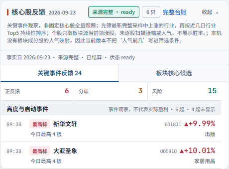

- 实时指数与成交：查看涨跌、成交、宽度和更新时间，判断市场是否扩散或收缩。

- 市场热力图：按涨跌、成交或活跃度定位高活跃区域，点击进入板块或个股。

- 涨停热力图：展示封单等实际可取得字段；分钟增减等未开放能力不伪装成可用功能。

- 盘面事件流：滚动呈现涨停、炸板、异动和公告事件，区分新发生与已结束。

- 市场电报：以短消息方式承载重要盘面变化，附来源和时间。

技术栈与实现｜实时摘要按数据源能力降级；事件流用时间序列和状态字段；ECharts 绘制热力图，前端按刷新状态更新。

### 盘中：板块轮动与资金结构

所属层级｜工作台 → 盘中。本分支的作用是把盘中阶段的市场事实组织成可直接执行的研究动作。

盘中观察不是只看最强板块，还要看轮动是否持续、资金是否集中和昨日落盘是否兑现。

板块轮动与市场热力图

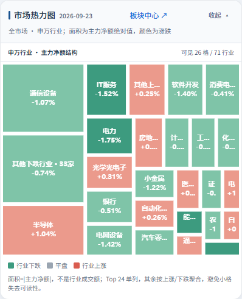

- 行业强弱：比较行业涨跌、广度和相对指数表现。

- 资金流向：查看当前快照与趋势，不把资金净流入直接等同于上涨质量。

- 题材热度：追踪题材热度变化，区分新扩散、持续和退潮。

- 昨日落盘：核对昨日复盘提出的方向是否在盘中得到验证。

- 每日独立 Top-N：每日生成独立板块观察结果，避免跨日直接拼接不同统计口径。

技术栈与实现｜板块、成分股、资金和交易日由统一 schema 连接；批量接口减少重复请求；前端提供板块→成分→个股三级跳转。

### 盘中：核心股与连板天梯

所属层级｜工作台 → 盘中。本分支的作用是把盘中阶段的市场事实组织成可直接执行的研究动作。

将市场最受关注的核心股票放进梯队和事件背景中，既看高度，也看断层、晋级和风险。

连板天梯

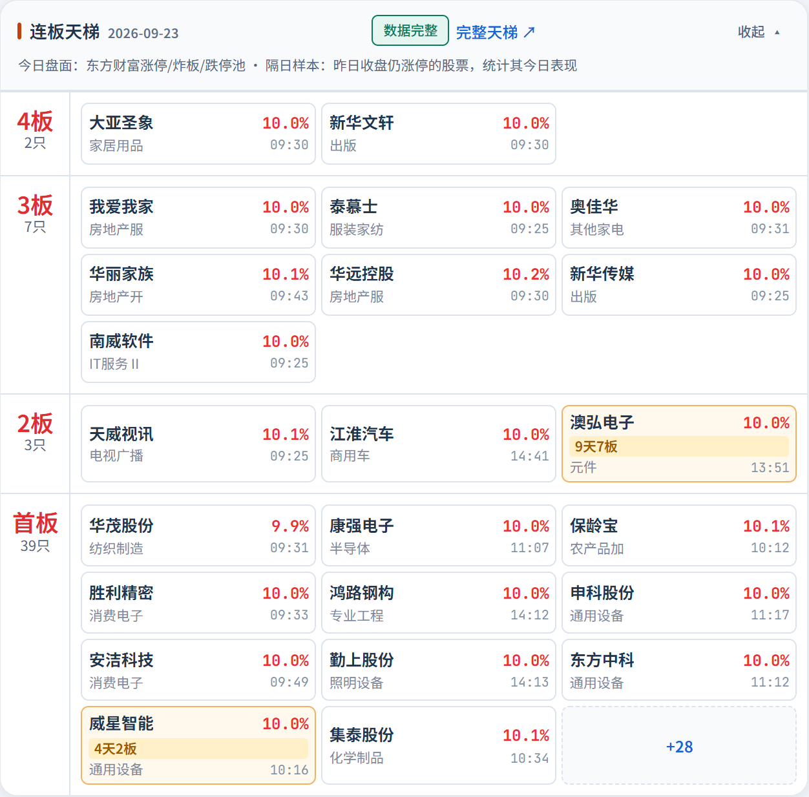

连板晋级率与封板质量

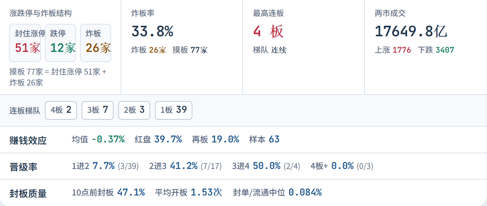

涨停热力图

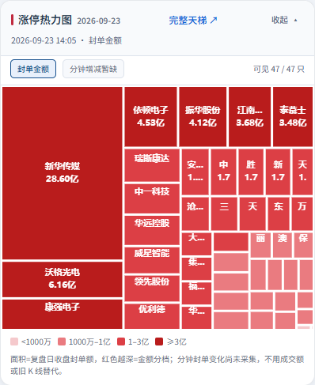

- 核心股候选：按板块、热度和短线表现列出候选，打开后可看机器人和异动。

- 关键事件反馈：将公告、监管或重大变化附在核心股卡片上。

- 连板天梯：按首板、二板到高位梯队展示数量、晋级和断层。

- 特殊标识：监管异动、N 天 M 板、明日触发线等必须用文字说明，颜色仅作辅助。

- 完整天梯入口：从工作台进入复盘中心的完整天梯，不在快捷卡里重复造一套数据。

技术栈与实现｜连板样本按交易日归档；板位与晋级率由后端统计；卡片跳转携带股票、板块和交易日参数。

### 盘后：当日事实回收

所属层级｜工作台 → 盘后。本分支的作用是把盘后阶段的市场事实组织成可直接执行的研究动作。

收盘后把盘中的变化收束成可复核的市场事实，为复盘中心和次日计划提供输入。

盘后事实与短线情绪

行业涨停结构

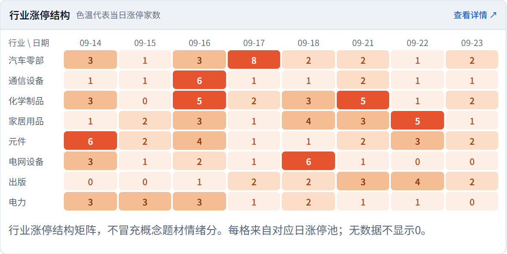

- 涨跌停回收：统计涨停、炸板、跌停及封板成功等结果。

- 短线情绪：显示市场宽度、昨日强势股反馈、接力成功和涨跌停强弱。

- 板块落盘：记录今日强弱、资金方向和题材热度，供下一交易日对照。

- 事件归档：将盘中事件流按交易日保存，保留来源、时间和状态。

技术栈与实现｜盘后任务使用交易日锁定样本；统计与事件分别存储；页面显示计算完成时间和缺失说明。

### 盘后：明日验证与研究入口

所属层级｜工作台 → 盘后。本分支的作用是把盘后阶段的市场事实组织成可直接执行的研究动作。

盘后不是给出一句结论，而是把判断转成第二天可以检查的条件。

- 明日条件：保存指标、比较方式、阈值、观察对象和核对时间。

- 进入复盘中心：从工作台跳到情绪周期、明日验证和竞价核验。

- 进入选股器：把板块和条件转成可重复扫描的规则。

- 进入 AI 研判：只将工作台已有事实和已选问题投影给模型。

技术栈与实现｜验证条件版本化保存；次日核验按交易日匹配；AI 请求携带事实快照而非整页 HTML。

### 工作台通用：个性化布局与状态

工作台的排列方式可以适应不同使用习惯，但自定义布局不改变底层事实。

工作台自定义与快捷研究

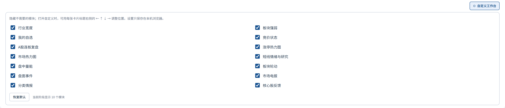

AI 助手与快捷研究入口

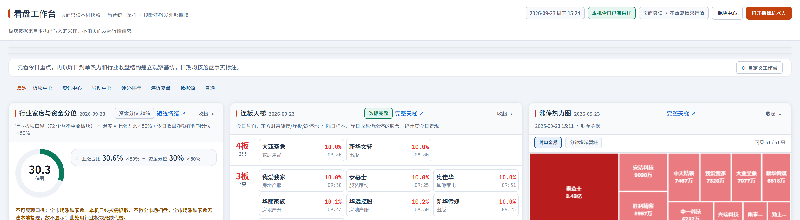

- 模块显示与隐藏：用户选择常用卡片，恢复默认时回到平台初始布局。

- 快捷入口：机器人、复盘、选股、AI、回测等入口只负责导航。

- 数据源提示：每块卡片显示更新时间、来源和状态。

- 猫咪助手：沿用站内统一助手入口，打开当前页的只读 AI 解释。

技术栈与实现｜布局偏好按账号保存；组件通过统一状态协议读取数据；导航复用既有路由，不复制业务逻辑。

### 工作台分支对应的技术结构

| 功能分支 | 用户能做什么 | 技术栈与实现重点 |
| --- | --- | --- |
| 阶段编排 | 盘前/竞价/盘中/盘后共用交易日上下文 | FastAPI 返回 phase、trade_date、as_of、source、status；前端按阶段切换，不重复请求无关数据。 |
| 市场卡片 | 指数、宽度、资金、情绪和热力图 | pandas 聚合横截面；ECharts 绘制比例、趋势和热力图；缺失状态由接口明确返回。 |
| 研究跳转 | 股票、板块、事件和 AI 快捷入口 | 统一 symbol/plate/trade_date 查询参数，确保从工作台进入下游页面时不丢上下文。 |

## A 股复盘中心｜十个分页与跨日闭环

复盘中心截图中的分页不是装饰导航，而是一条从当日事实到次日验收的研究链：复盘看板 → 盘面数据 → 首板分析 → 五日热度 → 涨停样本统计 → 连板天梯 → 情绪周期 → 明日验证 → 竞价核验 → 口径与证据。每个分页都保存交易日、样本范围和数据状态。

### 复盘看板

所属层级｜复盘中心 → 复盘看板。本分页负责复盘链中的一个环节，并将结果交给下一分页或下一交易日核验。

先看全市场广度和短线情绪，再看涨停、炸板、跌停、成交和最高连板。

复盘总览

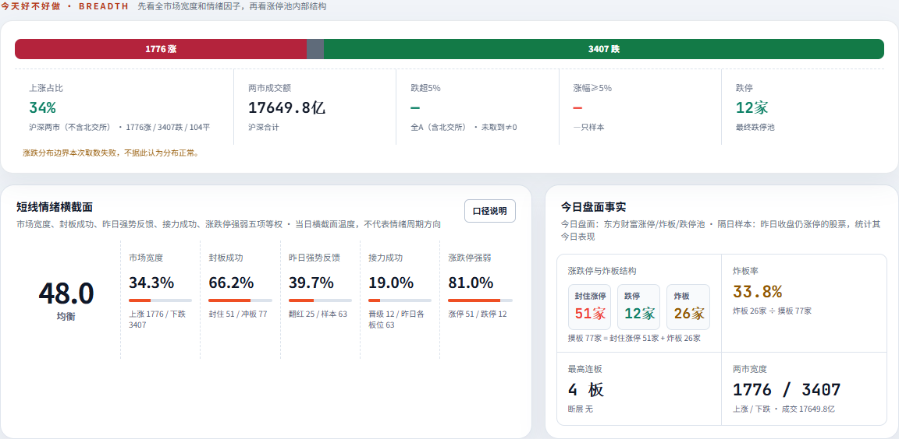

- 复盘日期：选择最新事实或历史交易日。

- 统计窗口：切换 20/60 等交易日窗口，观察当前值处于什么历史位置。

- 涨跌横截面：上涨、下跌、平盘、涨停和跌停同时呈现。

- 短线情绪横截面：市场宽度、封板成功、昨日强势股反馈、接力成功、涨跌停强弱五项并列。

- 今日盘面事实：展示当日样本，区分盘面事实和情绪解释。

技术栈与实现｜交易日服务统一样本；pandas 计算横截面与历史窗口；ECharts 绘制涨跌比例条与指标卡。

### 盘面数据

所属层级｜复盘中心 → 盘面数据。本分页负责复盘链中的一个环节，并将结果交给下一分页或下一交易日核验。

把 A 股、隔夜外围和重点美股分开呈现；先看各市场发生了什么，再回到 A 股短线复盘。

盘面数据

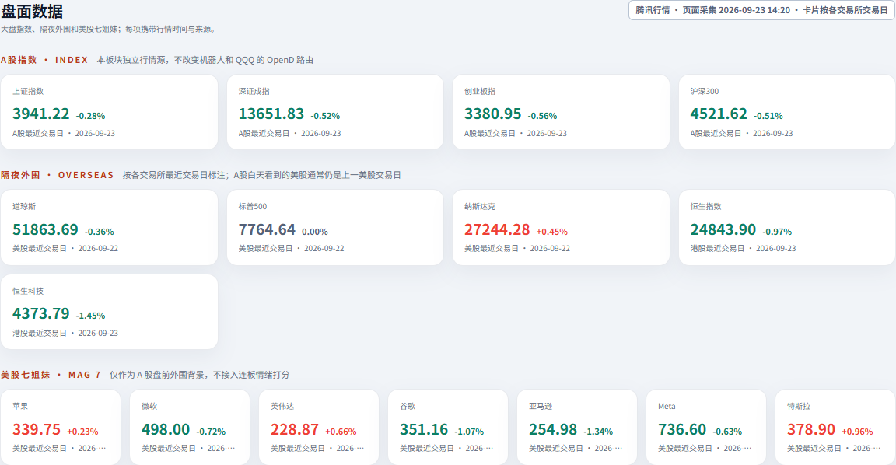

- A 股指数：并列查看上证、深证、创业板和沪深 300 等主要指数的涨跌与交易日。

- 隔夜外围：把美股主要指数和港股放在独立区域，明确各自最近交易日。

- 美股七姐妹：作为外部市场背景单独观察，不混入 A 股涨跌统计。

- 与复盘看板联动：先读指数背景，再返回涨跌家数、成交额与短线情绪判断市场结构。

- 数据时间：每块卡片保留来源与最近交易日，避免把隔夜数据当作 A 股当日数据。

技术栈与实现｜后端按市场和交易日规范化指数快照；前端卡片保留来源和日期，跨市场信息分区展示。

### 首板分析

所属层级｜复盘中心 → 首板分析。本分页负责复盘链中的一个环节，并将结果交给下一分页或下一交易日核验。

首板股票按首次封板时间排列，同时展示开板、成交、流通市值和行业，方便寻找新出现的短线方向。

首板分析

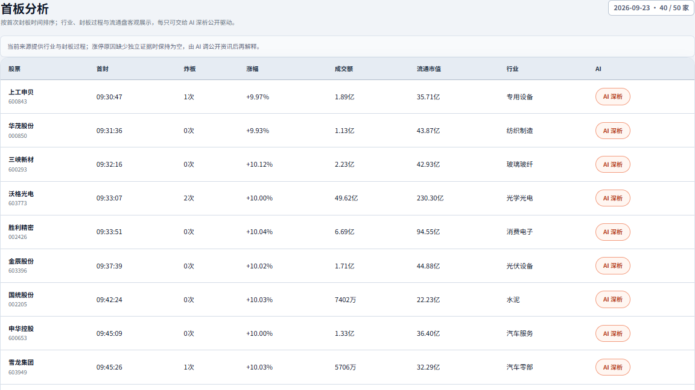

- 行业定位：每只首板股票保留行业字段，便于辨认当日新方向。

- 时间顺序：按首次封板时间阅读，区分早盘启动与尾盘封板。

- 封板质量：结合开板次数、换手率、成交额和流通市值观察。

- 样本下钻：从单只股票直接进入 AI 深挖，继续核查题材和风险。

技术栈与实现｜首板样本按交易日和股票代码汇总，行业映射接入证券主数据；表格与个股 AI 深挖共享标的标识。

### 五日热度

所属层级｜复盘中心 → 五日热度。本分页负责复盘链中的一个环节，并将结果交给下一分页或下一交易日核验。

把当天热点放入最近五个交易日，判断题材是在扩散、持续还是退潮。

五日热度

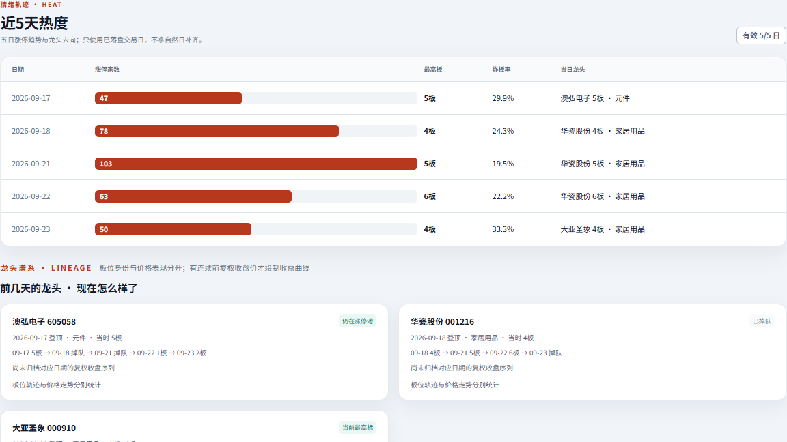

- 热度曲线：查看题材和板块近五日变化。

- 龙头谱系：标记核心股、跟随股和新出现的候选。

- 题材变化：比较新增、升温、降温和消失方向。

- 当天回看：从五日热度回到当日涨停和连板样本。

技术栈与实现｜以交易日为粒度保存热度快照；使用窗口聚合而非覆盖历史；前端用趋势图和分组卡表达变化。

### 涨停样本统计

所属层级｜复盘中心 → 涨停样本统计。本分页负责复盘链中的一个环节，并将结果交给下一分页或下一交易日核验。

先说明样本怎么来的，再解释统计结果，避免把不同口径混在一起。

涨停样本

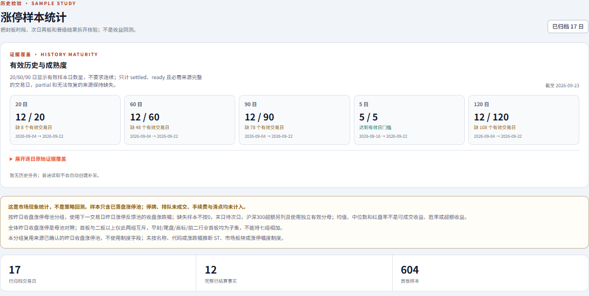

首板封板时间与次日表现

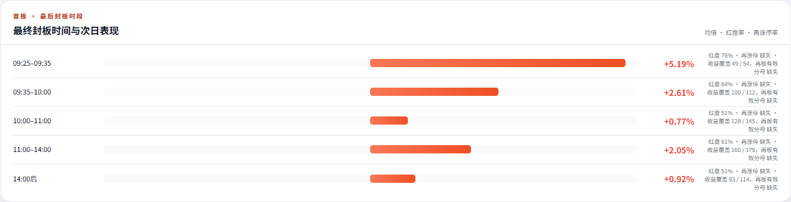

- 样本数量：展示纳入统计的股票数和排除项。

- 行业/题材分组：按行业、概念、板位等维度切换。

- 区间与日期：明确是当日、近五日还是更长窗口。

- 统计说明：解释涨停、炸板、跌停、晋级等字段的计算方式。

技术栈与实现｜统计接口返回样本分母、交易日和口径说明；分组计算可复现；页面对缺失与未覆盖单独标注。

### 连板天梯

所属层级｜复盘中心 → 连板天梯。本分页负责复盘链中的一个环节，并将结果交给下一分页或下一交易日核验。

按板位观察短线梯队，重点是晋级、断层和连板溢价，而不是只看最高板。

连板天梯

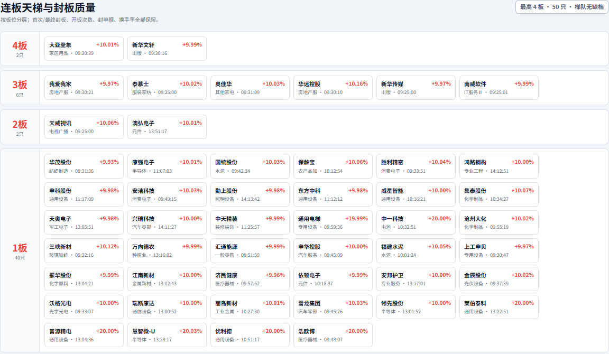

- 首板网格：查看当日新增首板和板块归属。

- 二板及以上：观察晋级结构、断层和核心梯队。

- 最高连板：显示高度及是否出现断层。

- 连板溢价：把昨日连板样本的隔日表现与今日结构分开统计。

- 完整天梯：从工作台快捷卡进入完整梯队页面。

技术栈与实现｜板位由连续交易日样本计算；昨日与今日样本严格错位；前端保留完整天梯与首板末尾“+N”入口。

### 情绪周期

所属层级｜复盘中心 → 情绪周期。本分页负责复盘链中的一个环节，并将结果交给下一分页或下一交易日核验。

把单日情绪放回历史分位，帮助区分体感强弱与统计位置。

情绪周期

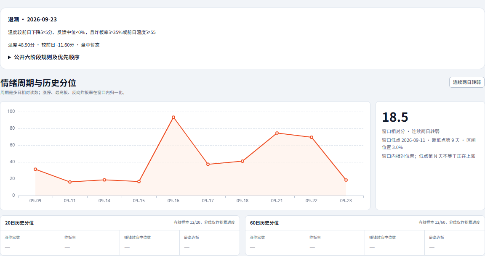

- 周期阶段：显示当前偏扩散、分化、退潮或修复的事实依据。

- 历史分位：对照历史窗口中的市场宽度、封板成功和亏钱效应。

- 阶段变化：记录与前一交易日相比是改善还是恶化。

- 风险提示：当样本过小或数据缺失时降低解释强度。

技术栈与实现｜历史分位采用固定窗口和交易日索引；周期状态由结构化字段组成，不由颜色单独推断。

### 明日验证

所属层级｜复盘中心 → 明日验证。本分页负责复盘链中的一个环节，并将结果交给下一分页或下一交易日核验。

把复盘结论写成第二天能检查的问题，而不是写成不可证伪的判断。

明日验证

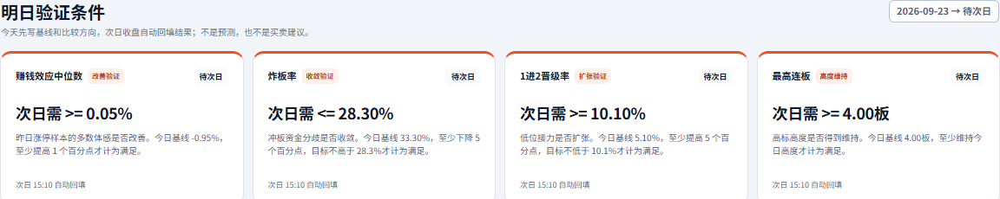

- 验证条件：保存指标、方向、阈值和时间。

- 验证对象：可选市场、板块、核心股或自选。

- 预期与失效：同时记录什么算验证、什么情况算失效。

- 历史记录：保留创建日、核对日和结果，避免修改过去条件。

技术栈与实现｜验证条件版本化存储；次日任务匹配交易日；页面将条件与实际结果分离展示。

### 竞价核验

所属层级｜复盘中心 → 竞价核验。本分页负责复盘链中的一个环节，并将结果交给下一分页或下一交易日核验。

把昨日条件与次日竞价、盘中关键时点放在同页核对。当前历史样本的 09:25 真实快照缺失，页面如实显示“未通过核验”。

- 多时点核验：展示 09:15、09:20、09:24:30、09:24:50、09:25 及盘中关键时点的采集状态；未通过核验不补造。

- 范围与时间：分别显示实际样本数、采集时刻和数据来源，缺失数据保持空状态。

- 昨日条件：把已保存的明日验证规则带入同一页面；无真实样本时不生成命中结论。

- 失败处理：明确失败时点、部分成功和重试，不将空值解释成弱势。

- 开盘后复盘：仅在真实样本可用时，将竞价结果与实际开盘及盘中反馈对照。

技术栈与实现｜采集任务与页面展示分离；来源、时间和采集状态随结果返回；缺失与结论分开呈现。

### 口径与证据

所属层级｜复盘中心 → 口径与证据。本分页负责复盘链中的一个环节，并将结果交给下一分页或下一交易日核验。

任何指标读不懂时回到这个分页，查看来源、日期、样本和计算方式。

口径与证据

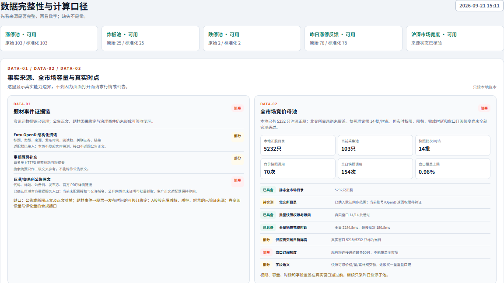

- 数据来源：列出行情、财务、资讯或计算来源。

- 核对时间：显示采集、计算和页面刷新时间。

- 缺失项：区分数据源失败、暂未覆盖和不适用。

- 公式与分母：解释涨跌、晋级率、炸板率、历史分位等。

- 证据链接：回到原始明细、公告或研报页面。

技术栈与实现｜口径说明与结果同接口返回；schema 记录单位和 as-of 时间；来源链接不由模型生成。

### 复盘中心的跨日流程

- 收盘后：锁定当日市场样本，生成涨跌、涨停、炸板、跌停和短线情绪。

- 复盘时：从看板下钻到首板、五日热度、连板和历史分位，形成可解释的判断。

- 保存时：把判断改写成明日验证条件，保存阈值、对象、时间和失效标准。

- 次日开盘前：竞价核验按五个时点读取真实状态，记录成功、部分成功或失败。

- 开盘后：将竞价与实际开盘、盘中板块和核心股反馈回写到下一次复盘。

## 完整功能模块

完整功能模块覆盖指标研究、指数决策、板块与个股分析、资讯证据、模拟验证和运行保障。工作台与复盘中心负责串联日内流程，其余入口围绕具体研究任务展开。

## 指标机器人

### 模块定位

指标机器人把四家族指标、周期状态、风险和解释集中在一只股票的研究入口中。它解决的是“当前信号由什么构成、哪些条件支持、什么情况会失效”。

### 关联模块

上游是行情与指标引擎，下游是异动、选股、自选、回测和 AI 解释；分支按周期、家族、信号状态和风险拆开，避免把原始指标、综合评分和交易动作混成一个数字。

### 核心功能

指标机器人是单只股票的核心研究入口。它把当前价格、多周期 K 线、指标家族、策略驾驶舱、综合评分、关键价位、风险状态和逐 K 信号快照放在一起。

这里展示“怎样读信号”，不公开内部公式、权重、具体阈值、参数组合和可复制的完整策略配方。用户可以理解页面怎样协助判断，但不会从展示材料直接复刻内部规则。

### 功能组成

### 功能 01：简化版阅读

页面区域： 快速阅读

怎么用： 输入代码后先看当前动作、周期、关键价位和数据新鲜度，决定是否展开专业版。

### 功能 02：专业版指标面板

指标图表、周期与信号

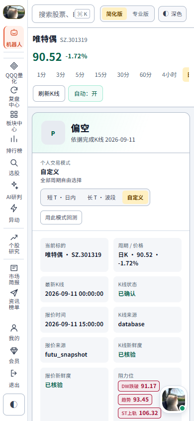

页面区域： 专业研究

怎么用： 查看 K 线、主图叠加、指标图例和策略驾驶舱，不把单个指标直接当成结论。

### 功能 03：指标家族协同

页面区域： 指标区域

怎么用： 分别阅读趋势、动量、资金和结构信息，先观察是否同向，再看冲突项。

### 功能 04：分层评分与信号确认

页面区域： 策略驾驶舱

怎么用： 先看基础方向，再看多周期共振、风险门槛和当前信号状态。评分表示证据强度，不等于胜率。

### 功能 05：手动过滤门槛

页面区域： 人工确认

怎么用： 按场景打开或关闭趋势、VWAP、量能等确认项，并查看通过或拦截原因。

### 功能 06：多周期切换

页面区域： 周期与价位

怎么用： 对照分钟、小时、日线、周线和月线背景，区分短周期动作与大周期方向；周期冲突时降低自动判断。

### 功能 07：关键价位与风险计划

页面区域： 关键价位

怎么用： 查看支撑、阻力、止损和数据来源，把信号阅读落到风险边界；核对后再制定风险计划。

### 功能 08：逐 K 信号快照

页面区域： 证据回看

怎么用： 点击某根已完成 K 线，回看当时的动作、评分、指标状态、风险和其他周期信息。

### 指标怎样配合

页面将多个指标家族分别作为不同观察角度：趋势类回答方向和背景，动量类回答变化速度，资金与成交类回答参与度，结构类回答位置和形态。系统先整理出基础方向，再以分层方式汇总证据强度，随后把多周期状态和风险门槛作为额外上下文。

推荐阅读顺序：

- 先看当前周期和数据更新时间，确认自己看到的是什么时点。

- 看趋势、动量、资金和结构是否同向，先识别冲突，不急着看总分。

- 看评分处于候选、确认、保持还是观望等状态，并查看支持项和拦截项。

- 按场景使用人工过滤：顺势、突破、回踩或震荡时，确认要求可以不同。

- 回到关键价位和逐 K 快照，确认风险边界和触发原因。

### 使用结果

- 把“这只股票现在怎么样”拆成趋势、结构、资金和风险四个可读维度。

- 让评分回到证据和状态，而不是只显示一个没有解释的买卖标签。

- 支撑、阻力、止损和数据来源分开表达，便于形成风险计划。

- 同一组信号语义可以继续被异动中心、回测中心和质量统计使用。

### 技术栈与实现

Python 指标计算层输出结构化指标与信号快照，FastAPI 提供数据，ECharts 绘制 K 线和指标，前端承载人工确认开关。页面展示信号阅读逻辑，内部公式、权重、阈值和策略配方保持封装。

## QQQ 量化决策台

### 模块定位

QQQ 量化决策台负责指数与海外市场的方向、波动和风险背景，为 A 股盘前和全球政策观察提供参照。

### 关联模块

上游是指数行情和宏观背景，下游是工作台盘前、资讯中心和 AI 解释；分支按指数、周期、方向和风险展开，便于把外部环境与本地市场分开阅读。

### 核心功能

QQQ 量化决策台把指标、门控、逐 K 证据和复盘思路扩展到 QQQ / 纳斯达克代理数据。它的重点是验证研究方法怎样迁移，并明确数据源、代理关系和不可执行边界，不把代理行情包装成真实期货行情。

### 功能组成

### 功能 01：QQQ 决策台总览

QQQ 决策总览

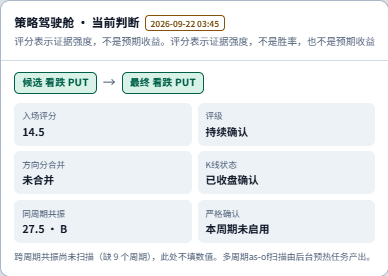

QQQ K 线与指标证据

页面区域： 决策台

怎么用： 选择日期和周期，先看方向、门控、风险和数据来源。

### 功能 02：逐 K 证据

页面区域： 证据下钻

怎么用： 从总览进入单根 K 线，核对当时可见的指标和门控结果。

### 功能 03：数据源与代理边界

页面区域： 状态说明

怎么用： 先确认实时、历史、缓存或代理状态，再决定是否只用于研究。

### 使用结果

同一套研究阅读方式可以在另一类数据上验证，但实时性、数据代理和真实可执行性被分开说明，避免把研究演示误读为真实下单入口。

### 技术栈与实现

页面使用独立的 QQQ 数据投影和只读决策路径，明确数据来源、代理关系和不可执行状态，不复用股票订单适配器。

## 板块中心

### 模块定位

板块中心把行业、概念、成分股、资金和热度放在同一层级，回答“强弱发生在哪个板块，板块内部是否扩散”。

### 关联模块

上游是市场行情和板块成分，下游是排行榜、工作台、选股和个股机器人；分支按板块概览、成分股、资金流和历史变化组织。

### 核心功能

板块中心从行业、概念和指数观察市场结构，连接板块轮动、资金趋势、成分股和个股研究。

### 功能组成

### 功能 01：行业 / 概念板块比较

行业与概念板块

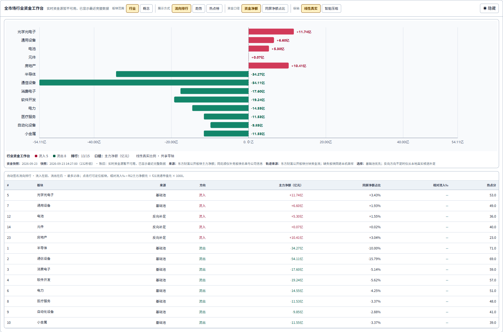

板块列表与跨模块入口

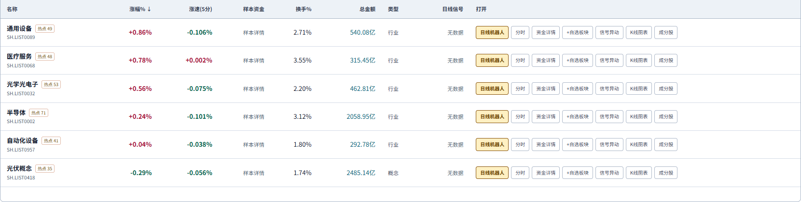

页面区域： 板块总览

怎么用： 选择板块，查看涨跌、成交额和强弱排序。

### 功能 02：资金快照与趋势

页面区域： 资金分析

怎么用： 对照当前快照、分钟趋势、日期和样本口径。

### 功能 03：板块成分股

页面区域： 成分下钻

怎么用： 从板块进入成分股，再继续到机器人或选股。

### 功能 04：指数结构

页面区域： 指数对照

怎么用： 对照主要指数与板块表现，判断变化来自大盘还是局部方向。

### 使用结果

单股研究可以被放回所属板块和指数背景；资金结果带有日期和计算口径；从面到点的跳转保持连续。

### 技术栈与实现

板块、指数、成分股和资金趋势通过统一结构化接口连接，页面按数据日期和样本范围呈现结果。

## 排行榜

### 模块定位

排行榜提供市场横截面入口，把涨跌、成交、热度、信号和板块排序成可点击的候选集合。

### 关联模块

上游是行情、指标和板块关系，下游是机器人、异动、选股和自选；分支按排序主题和时间窗口拆分，避免把榜单排名误写成系统评分。

### 核心功能

排行榜把涨幅、成交、估值、板块表现、指标状态和机器人信号组织成候选发现入口。

### 功能组成

### 功能 01：多维排行榜

多维排行榜

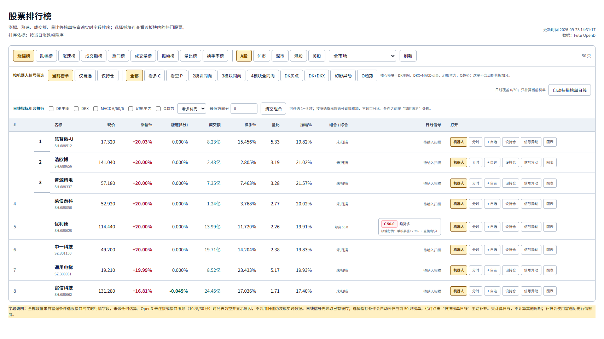

页面区域： 排行维度

怎么用： 选择市场、板块、排序字段和方向，扫描候选。

### 功能 02：机器人信号排行

页面区域： 信号排行

怎么用： 按动作、趋势或风险状态缩小范围，再进入单股研究。

### 使用结果

把“先看哪些股票”变成可重复运行的发现过程，并能从榜单直接进入指标、板块或回测。

### 技术栈与实现

后端返回筛选和排序后的结构化候选，前端负责维度切换、排序表达和详情导航。

## 智能选股

### 模块定位

选股器把经典策略条件、指标字段、板块范围和自然语言描述转成可复核的候选清单。

### 关联模块

上游是确定性指标和股票池，AI 负责解析口语并审核条件，下游是机器人、板块、异动和自选；分支按预设策略、自定义条件、自然语言和历史结果区分。

### 核心功能

选股把趋势方向、评分区间、指标状态、成交和板块归属等研究想法写成可保存、可重复运行的条件组合。

### 功能组成

### 功能 01：条件输入

自然语言与条件选股

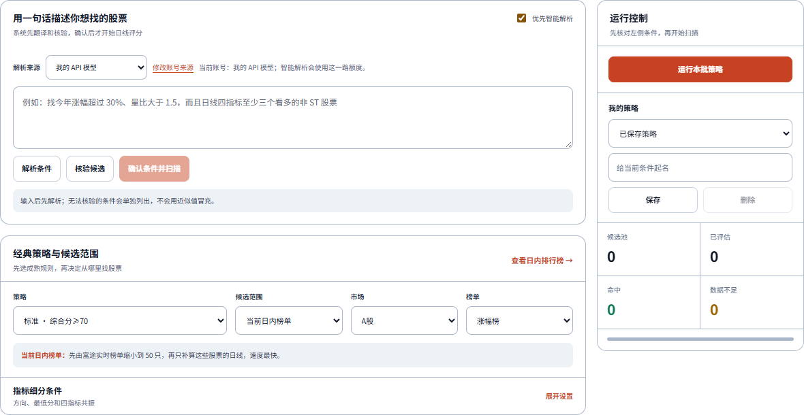

页面区域： 条件编辑

怎么用： 选择字段、方向、范围或状态，逐条建立筛选条件。

### 功能 02：全部满足 / 任一满足

页面区域： 条件组合

怎么用： 选择条件组合逻辑，表达不同研究假设。

### 功能 03：候选结果

页面区域： 结果列表

怎么用： 运行筛选，查看命中数量、候选列表和数据状态。

### 功能 04：命中原因

页面区域： 结果解释

怎么用： 打开单个候选，查看哪些条件命中，再进入机器人或回测。

### 使用结果

候选池可以重复生成，每个候选保留命中解释，筛选、单股研究和回测连接成一个工作流。

### 技术栈与实现

筛选条件保存为可重复执行的规则组合，后端负责候选与命中解释，前端负责条件编辑和结果联动。

## AI 研判页面

### 模块定位

AI 研判页是三路模型、权限、普通问答和研究任务的控制入口；完整的跨域 AI 说明放在前置“AI 助手”大模块。

### 关联模块

上游是账号授权、模型路由和系统事实，下游是工作台、复盘、选股、个股研究和任务通知；分支按模型来源、任务类型和成本状态展开。

### 核心功能

AI 研判不是脱离数据的聊天框，而是把平台已有的行情、指标、复盘、估值、资讯和研报事实，按问题投影给模型做只读总结、比较和追问。

### 功能组成

### 功能 01：股票、复盘、资讯和研报问题

页面区域： 问题入口

怎么用： 先选问题类型和研究对象，明确模型要回答什么。

### 功能 02：BYOK / 授权共享模型 / 本机 Agent

模型来源与账号授权

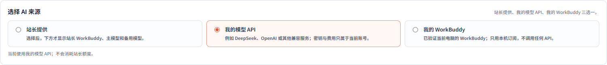

页面区域： 模型路径

怎么用： 确认使用的模型路径，不隐式消耗其他账号的额度。

### 功能 03：来源、时间和缺失项

页面区域： 事实范围

怎么用： 查看模型收到哪些事实，再阅读生成结果。

### 功能 04：研究任务

页面区域： 任务状态

怎么用： 长任务查看排队、执行和结果状态，普通问答不伪装成完整研究。

### 怎么用

- 选择股票解释、市场复盘、资讯总结或研报阅读等问题类型。

- 确认自己的 BYOK、经授权的共享模型或本机 Agent 路径。

- 查看模型收到的事实范围、来源时间和缺失项。

- 阅读带事实依据和限制条件的回答，再沿同一研究对象继续追问。

### 使用结果

- 模型负责整理和解释，原始事实、来源时间和缺失项仍然可见。

- 普通问答、事实扫描和完整研究任务有不同边界。

- AI 只做辅助研判，不执行真实下单，也不替代行情和证据。

### 技术栈与实现

系统先读取平台事实，再按问题做有界投影；模型路径与权限在服务端隔离，长任务使用可追踪状态。展示材料不放任何密钥、内部提示词或可复现的私有配置。

## 异动中心

### 模块定位

异动中心只突出重要变化：候选、正式确认、信号结束、风险变化和板块异动，并保留历史时间线。

### 关联模块

上游是指标快照、生命周期和板块扫描，下游是机器人详情、分时和研究记录；分支按股票/板块、周期、方向和历史事件筛选。

### 核心功能

异动中心从全市场或指定范围反向寻找指标信号，并记录信号从出现、确认、保持到撤回或结束的过程。

### 功能组成

### 功能 01：当前有效信号

异动信号

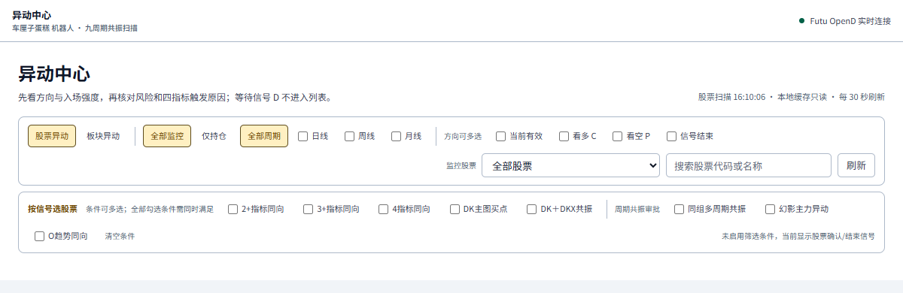

页面区域： 异动总览

怎么用： 先选择自选、持仓或全市场范围，再看当前信号。

### 功能 02：周期、方向、指标和状态

页面区域： 条件筛选

怎么用： 缩小扫描范围，只看需要处理的信号。

### 功能 03：单股异动详情

页面区域： 单股下钻

怎么用： 查看一只股票多个周期的状态，并跳转机器人核对 K 线。

### 功能 04：信号生命周期

页面区域： 历史记录

怎么用： 按触发和结束时间回看信号过程，区分短暂预警和持续状态。

### 使用结果

预警、确认和历史结束记录分开保存；用户既可以从一只股票追溯，也可以从全市场发现新的关注对象。

### 技术栈与实现

信号事件单独记录触发、确认、保持和结束时间，页面按股票、周期、方向和指标组合筛选。

## 个股研究

### 模块定位

个股研究把短线、波段和长线放进同一条证据链，补充公司资料、财务、技术和风险，而不是只输出一段 AI 文字。

### 关联模块

上游是标的解析、行情、财务和公告，下游是研究归档、样本检验、机器人和 AI 追问；分支按研究视角、阶段结果、证据缺口和样本验证组织。

### 核心功能

个股研究从业务、财务、行业、估值和支持/反对证据整理一条可回看的研究命题。它不把一个估值数字直接当成结论，而是保留事实、来源和后续验证方向。

### 功能组成

### 功能 01：业务、财务与行业背景

页面区域： 研究总览

怎么用： 选择股票，先阅读结构化基本面和所属行业。

### 功能 02：支持与反对证据

页面区域： 证据区

怎么用： 将重要事实分组，区分事实、判断和还需验证的部分。

### 功能 03：命题与后续验证

页面区域： 研究记录

怎么用： 保存当前判断、数据日期和下一步核验方向。

### 使用结果

研究记录可以回到原始输入和来源，支持继续进入 PEG、资讯、机器人或 AI，而不是只留下一个主观标签。

### 技术栈与实现

财务、业务、估值和研究命题被组织成结构化事实与研究记录，结果保留来源、日期和缺失项。

## PEG 估值

### 模块定位

PEG 估值把价格、前瞻 PE 和利润增长放在一起，帮助用户判断“资料是否足够计算”，而不是给出脱离口径的估值结论。

### 关联模块

上游是财务和价格数据，下游是个股研究、AI 解释和资料补充；分支按市场横截面、单股三项数据、完整性和缺口提示拆开。

### 核心功能

PEG 估值把现价、PE、盈利增长、来源和适用性放在同一页面。它是估值辅助工具，不是独立投资结论。

### 功能组成

### 功能 01：估值输入字段

页面区域： 输入区

怎么用： 逐项确认现价、PE、增长率、来源和数据日期。

### 功能 02：PEG 计算结果

PEG 估值结果

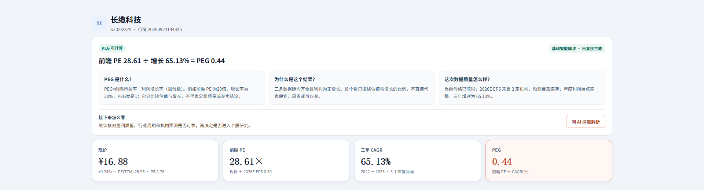

PEG 数据质量与增长依据

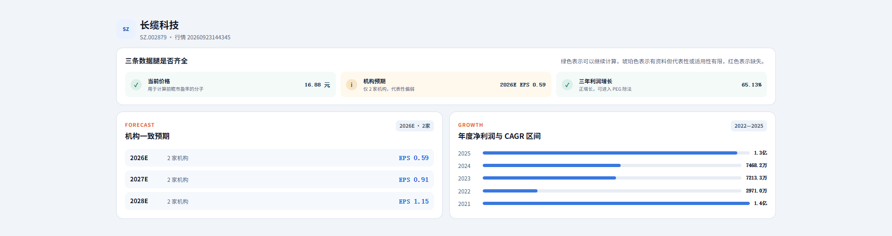

页面区域： 结果区

怎么用： 查看结果与输入字段的对应关系，再和个股研究中的其他证据对照。

### 功能 03：缺失与不适用

页面区域： 边界区

怎么用： 处理负增长、字段缺失或来源异常，区分“算不出来”和“不适用”。

### 使用结果

计算依据可回看；关键字段缺失或增长率不适用时不会强行解释结果。

### 技术栈与实现

服务端先校验输入字段、来源和适用性，再由前端展示结果或明确限制状态。

## 市场简报

### 模块定位

市场简报把每日市场事实压缩成开盘前或盘后可快速阅读的摘要，是工作台的文字化背景层。

### 关联模块

上游是行情、成交、宽度和事件，下游是复盘、AI 助手和资讯中心；分支按时间、主题和数据状态组织。

### 核心功能

市场简报把当天市场重点事实、指数、情绪和风险整理成开场阅读，让用户先获得背景，再决定进入复盘、工作台或单股研究。

### 功能组成

### 功能 01：当日重点事实

每日市场简报

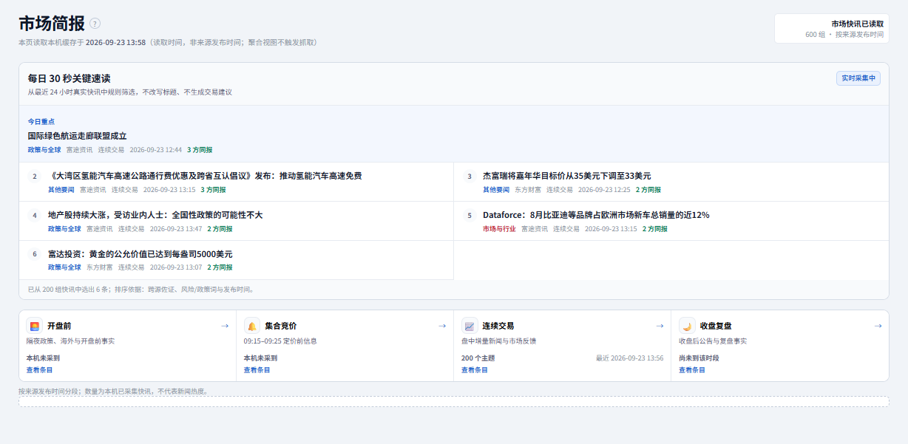

页面区域： 简报首页

怎么用： 打开后先读重点内容，建立市场背景。

### 功能 02：来源与时间

页面区域： 事实详情

怎么用： 打开条目核对来源、事实日期和可用状态。

### 使用结果

减少信息分散；摘要保留来源与时间，不把摘要冒充完整事实。

### 技术栈与实现

市场事实按交易日聚合，页面保留事实日期、来源和可用状态。

## 资讯雷达

### 模块定位

资讯雷达聚合重点主题、公司和市场动态，帮助用户发现需要进一步验证的事件。

### 关联模块

上游是带来源的资讯采集，下游是产业信号、研报、个股研究和 AI 解释；分支按主题、来源、时间和重要性筛选。

### 核心功能

资讯雷达集中筛选新闻、公告和主题资讯，帮助用户从信息流中找到需要进一步核验的线索。

### 功能组成

### 功能 01：新闻与公告筛选

页面区域： 雷达列表

怎么用： 按来源、时间、主题和标的缩小范围。

### 功能 02：资讯事实下钻

页面区域： 筛选与详情

怎么用： 打开条目查看发布时间、来源和正文，再带入后续研究。

### 使用结果

把信息发现和事实核验分开，资讯不会直接被包装成股票信号。

### 技术栈与实现

资讯接入层按来源、时间、主题和标的建立可筛选索引，正文查看继续回到来源。

## 产业信号

### 模块定位

产业信号把 GPU 租赁、台湾月营收、商品和 DRAM 等专题资料独立呈现，避免把异构数据硬塞进股票评分。

### 关联模块

上游是专题数据源和授权状态，下游是市场简报、个股研究和 AI 解释；分支按主题、更新频率和授权/缺失状态区分。

### 核心功能

产业信号集中展示 GPU 租金、原材料、招聘等产业侧硬数据及相关资讯，为行业研究提供可核对的证据。

### 功能组成

### 功能 01：产业硬数据

页面区域： 产业列表

怎么用： 按产业主题或数据类型查看数值、日期和来源。

### 功能 02：产业趋势关联

页面区域： 数据详情

怎么用： 将数据与相关资讯并列，再结合板块、个股和估值继续研究。

### 使用结果

产业数据与普通新闻分开，日期和来源可以回看；页面不会把行业事实直接转换成个股推荐。

### 技术栈与实现

产业数据和资讯使用独立的数据模型与来源标记，避免信息类型混淆。

## 资讯榜单

### 模块定位

资讯榜单把资讯按热度、来源和时间排序，用于快速发现值得打开原文的内容。

### 关联模块

上游是资讯快照，下游是资讯详情、研报和 AI 资料解读；分支按榜单主题和时间窗口组织。

### 核心功能

资讯榜单按热度和关注度浏览信息排行，是快速发现线索的入口，不把排名本身当成投资结论。

### 功能组成

### 功能 01：热点排行

页面区域： 榜单页

怎么用： 查看当前资讯热度和关注度排行。

### 功能 02：排行联动

页面区域： 榜单详情

怎么用： 从热点条目进入资讯雷达、产业信号或个股研究，再回到原文核验。

### 使用结果

热点发现更快，同时保持热度、来源和事实结论的边界。

### 技术栈与实现

榜单使用独立排序结果作为信息发现入口，并保留从热度条目回到来源的路径。

## 实时动态

### 模块定位

实时动态承载盘中电报、事件和数据更新，让用户知道页面何时变化、变化来自哪里。

### 关联模块

上游是实时源和缓存，下游是工作台、异动和复盘；分支按事件类型、时间和来源状态筛选。

### 核心功能

实时动态按时间展示滚动更新的市场资讯和事件流，并同时显示更新时间和来源状态。

### 功能组成

### 功能 01：滚动事件流

页面区域： 动态流

怎么用： 按时间阅读最新动态，打开条目查看详细内容。

### 功能 02：时效状态

页面区域： 动态详情

怎么用： 核对事件时间、来源和当前可用状态，再决定是否带入研究上下文。

### 使用结果

滚动信息不与历史资料混淆，更新时间和来源状态一起展示。

### 技术栈与实现

实时动态按事件时间和来源更新，前端显示时效状态，避免旧动态被误读为实时消息。

## 研报中心

### 模块定位

研报中心保存券商报告、原文入口和可读内容，为个股研究和 AI 资料解释提供较长周期证据。

### 关联模块

上游是报告索引和文档读取，下游是个股深挖、PEG 和 AI；分支按标的、来源、报告类型和读取状态组织。

### 核心功能

研报中心把研报列表、PDF、解析正文、来源、时间和页码证据连接起来，让文档可以搜索、定位、回看和进入只读研究。

### 功能组成

### 功能 01：文档检索

页面区域： 研报列表

怎么用： 按标题、来源、行业、时间或处理状态筛选。

### 功能 02：PDF 与解析正文

页面区域： 文档阅读

怎么用： 打开原文和解析正文，保留页码或原文定位。

### 功能 03：研报 AI 阅读

页面区域： 辅助阅读

怎么用： 确认文档范围和来源后，让模型做摘要、比较和追问。

### 使用结果

研报摘要不会替代原文位置，研究结论可以回到文档、来源和页码证据。

### 技术栈与实现

研报文件、解析正文和原文定位分层保存，页面用列表、文档和 AI 阅读入口连接。

## 自选中心

### 模块定位

自选中心把用户关注的股票、板块和策略条件保存成跨页面入口，减少重复搜索。

### 关联模块

上游是机器人、板块、选股和异动，下游是工作台、竞价提醒和质量观察；分支按对象类型、策略命中和当前状态筛选。

### 核心功能

自选中心按研究主题、策略候选和持仓对象管理分组，并作为工作台、异动、选股和机器人共享的输入池。

### 功能组成

### 功能 01：自选分组

自选分组

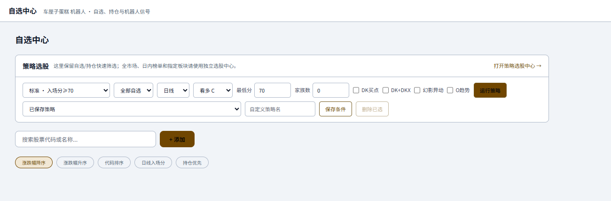

页面区域： 分组页

怎么用： 创建或选择分组，区分持仓、主题和策略候选。

### 功能 02：标的与备注

页面区域： 编辑区

怎么用： 添加、删除、排序股票并填写研究备注。

### 功能 03：自选策略筛选

页面区域： 分组研究

怎么用： 只对当前分组运行策略，再批量进入机器人或异动扫描。

### 使用结果

自选不只是收藏列表，而是多个研究页面之间可复用的输入集合。

### 技术栈与实现

自选分组作为共享输入池，保存状态由账号与数据库承载，不只依赖浏览器临时状态。

## 模拟交易

### 模块定位

模拟交易把研究信号放进只读、非真实成交的执行练习环境，观察订单、持仓和成本口径。

### 关联模块

上游是选股、机器人和回测，下游是质量与复盘；分支按账户、订单、持仓和风险状态区分，绝不连接真实下单。

### 核心功能

模拟模块提供虚拟资金、模拟买卖、持仓、盈亏和订单记录，用于演练研究结论的执行过程，不连接真实交易下单。

### 功能组成

### 功能 01：模拟账户

模拟交易

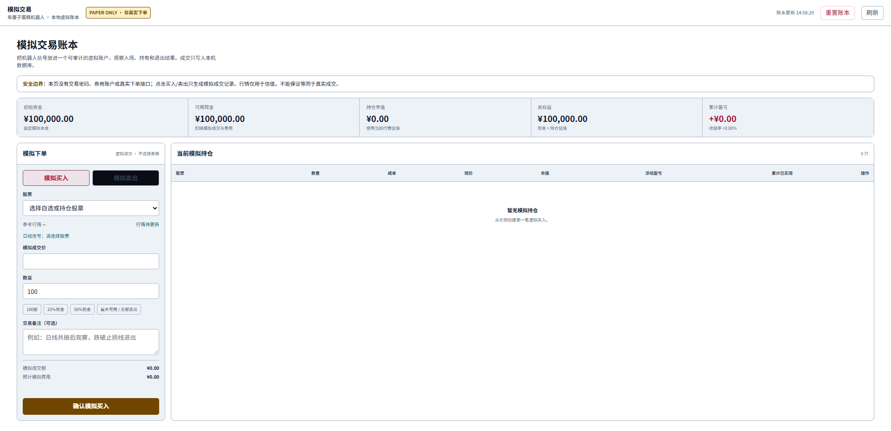

页面区域： 账户页

怎么用： 查看虚拟资金、当前权益和账户状态。

### 功能 02：模拟订单

页面区域： 订单页

怎么用： 输入股票、方向、数量和价格，提交模拟记录。

### 功能 03：持仓与盈亏

页面区域： 持仓页

怎么用： 查看成本、浮动盈亏和已实现盈亏，再回看研究依据。

### 使用结果

把研究结论延伸到仓位和执行，但隔离真实资金和真实交易通道。

### 技术栈与实现

模拟账户和订单使用独立的虚拟资金模型，与真实交易接口隔离。

## 回测中心

### 模块定位

回测中心逐根重建当时可见的信号，用来比较正式信号、候选信号和生命周期风控，而不是展示一条好看的收益曲线。

### 关联模块

上游是指标快照、行情、成本和策略版本，下游是质量中心和规则调整；分支按策略模式、周期、成本和样本区间组织。

### 核心功能

回测中心在明确的历史窗口中比较信号模式、周期和持有期，输出收益、回撤、胜率、交易数量、曲线、逐笔明细和数据覆盖。

### 功能组成

### 功能 01：回测参数

回测参数与收益风险对照

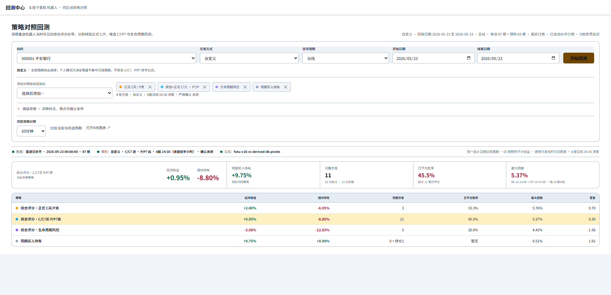

同期收益曲线与交易明细

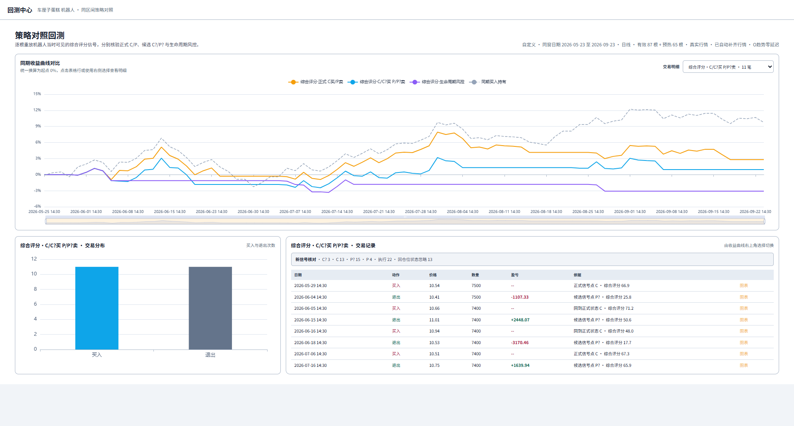

页面区域： 参数区

怎么用： 选择标的、周期、开始日期、结束日期、信号模式和持有期。

### 功能 02：收益与风险结果

页面区域： 结果区

怎么用： 查看收益、回撤、胜率、交易数量和同期买入持有对照。

### 功能 03：逐笔成交

页面区域： 明细区

怎么用： 点击某笔交易回到对应 K 线和信号，核验当时可见信息。

### 功能 04：收益曲线、数据覆盖与假设

页面区域： 图表与审计

怎么用： 查看权益曲线、来源、时间范围、缺失、未平仓和执行假设。

### 使用结果

- 与同期买入持有放在同一窗口比较。

- 区分已平仓、未平仓、最大回撤和数据覆盖。

- 缺少真实行情时明确无法计算，不用随机数据填补生产缺口。

### 技术栈与实现

回测固定历史窗口和执行假设，结果、逐笔成交和覆盖审计互相链接，便于从结果回到当时的信号事实。

## 信号质量

### 模块定位

质量中心把信号之后的 5、10、20 根表现和无条件基准并列，给“准不准”提供可量化的复核入口。

### 关联模块

上游是历史信号事件和后续 K 线，下游是权重、阈值和策略复盘；分支按标的、周期、事件类型、方向和样本量筛选。

### 核心功能

信号质量统计检查信号出现后未来若干根 K 线的表现，并与无条件基准比较，让工具接受样本检验而不是只展示漂亮个案。

### 功能组成

### 功能 01：样本与覆盖范围

信号前向表现与样本口径

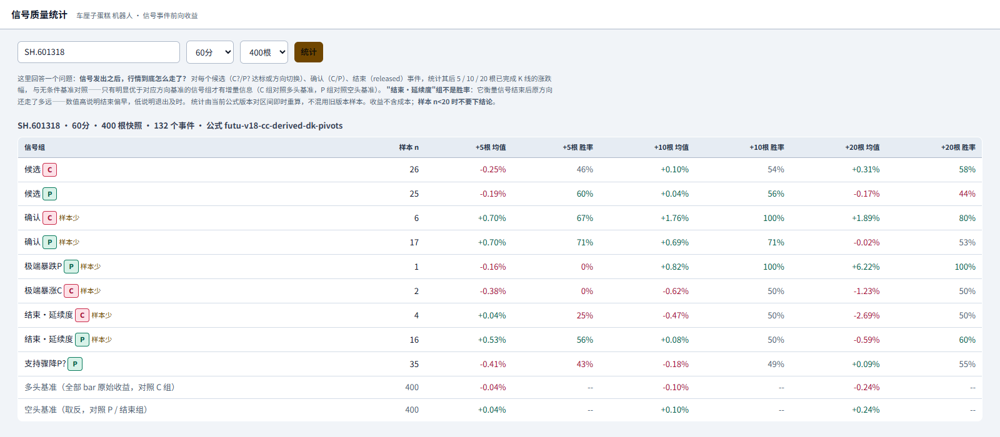

逐条信号事件与前向结果

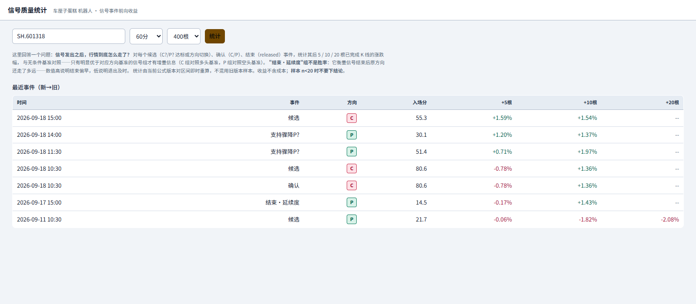

页面区域： 质量总览

怎么用： 选择股票、信号类型和时间范围，先看样本数量。

### 功能 02：候选、确认和结束样本

页面区域： 事件表

怎么用： 按事件状态查看样本、日期和统计口径。

### 功能 03：未来收益与基准

页面区域： 统计图

怎么用： 对照信号后 5、10、20 根 K 线与无条件基准的分布。

### 使用结果

把“信号出现过”和“信号在样本上是否有区分度”分开，结果带有样本量、覆盖范围和窗口。

### 技术栈与实现

系统为信号事件建立前向收益样本，并和无条件基准对照，避免把单个案例当作统计结论。

## 数据源与运行状态

### 模块定位

数据源页告诉用户行情、财务、资讯和模型当前是否可读、来自哪里、最后更新时间是什么。

### 关联模块

上游是 Futu OpenD、缓存和专题适配器，下游是所有展示与 AI 工具；分支按数据类型、连接状态、更新时间和回退来源拆开。

### 核心功能

数据源状态页展示行情、历史回补、资讯、缓存和应用服务的连接、更新时间、能力与降级原因。

### 功能组成

### 功能 01：节点状态

数据源状态

页面区域： 状态总览

怎么用： 查看 Futu OpenD、历史回补和应用服务是否在线。

### 功能 02：更新时间与来源

页面区域： 状态总览

怎么用： 对照结果的来源标签、数据日期和新鲜度。

### 功能 03：具体能力检查

页面区域： 能力详情

怎么用： 分开检查实时报价、K 线、财务字段、资讯和缓存是否可用。

### 使用结果

“服务在线”和“目标字段可用”被分开检查。出现异常时，用户能知道问题来自节点、字段、缓存过期还是外部来源失败。

### 技术栈与实现

平台按具体数据能力检查节点、更新时间、缓存和降级原因，而不是用一个笼统的在线状态覆盖所有请求。

## 附录｜原展示首页的完整阅读入口

原展示仓库的首页、宣传页、旧版说明和截图清单全部保留。本附录把静态首页放在新产品模块之后，方便继续浏览；当前功能以正文说明为准。

### 首页开场｜把行情、研究、验证放进一条可回看的工作流

原首页从实时行情、指标和复盘出发，连接策略筛选、回测、资讯、估值与 AI 辅助研判。首屏提供截图和完整说明两条阅读路径；展示仓库不含业务源码、数据库、密钥或生产配置。

### 截图展览｜先看真实产品，再看功能拆解

首页先陈列真实产品界面，再按模块展开功能、用法和截图位。实际图片须核对来源、账号信息与功能状态；未补图的位置不使用宣传插画冒充实拍。

### 研究流程｜发现、研究、验证、回看

发现：工作台、自选、板块、指数与排行确认市场状态。研究：指标、复盘、估值、资讯与 AI 拆解证据。验证：策略、回测和质量统计核对历史窗口。回看：从模拟、档案、来源时间和数据状态返回事实。

### 模块导航｜从入口到最小功能

原首页提供入口筛选、搜索、展开说明和模块详情，覆盖工作台、指标、QQQ、复盘、板块、排行、选股、AI、异动、估值、资讯研报、自选、模拟、回测、质量与数据源。首次访问可快速定位；正文提供更细的功能关系。

### 技术与架构｜数据先成为事实，再成为结论

首页分别介绍前端、后端、数据、研究与 AI、部署和术语。架构图串起来源、接入、计算、接口与页面；正文继续说明各项技术落地在哪些功能，以及模块之间怎样衔接。

### 原首页的技术分组

前端：HTML、CSS、JavaScript 与 ECharts 负责结构、交互、图表和响应式页面。后端：Python、FastAPI、Uvicorn、REST API 和异步任务承接页面请求。数据与存储：Futu OpenD、SQLAlchemy、SQLite 和缓存管理来源、保存与时效；原首页也列有 baostock，但现阶段仅在形态扫描方案中评估，不写成已经上线的数据源。

研究与 AI：多周期指标、回测、PEG、BYOK 和 Agent 各有独立职责。部署：原首页展示 Linux、nginx、systemd、HTTPS 和 Cloudflare Pages 等技术方向；当前动态站仍由 Windows 本机、Uvicorn 与 Cloudflare Tunnel 提供，不把规划中的 Linux 迁移写成已完成。术语：API、As-of、BYOK 等另有通俗解释。

### 架构图｜四层串联，四种数据状态

行情与资讯源进入数据接入和事实层，保留来源、时间、标的、周期与状态；指标、复盘、估值、策略和回测在研究层计算，再由 FastAPI、JavaScript 和 ECharts 呈现。页面分别说明实时、缓存、历史回补与不可用：缓存命中不等于实时报价，缺少可信口径时显示受限状态。

### 展览的维护方式

原首页留有 22 个产品入口与 81 个截图位。新功能先在真实产品中验证，再补模块说明与实拍截图；宣传页、原静态首页和旧版说明继续作为早期展示的可访问记录。展示仓库只发布适合公开的产品材料，不以修改私人项目或复制生产数据换取展示效果。

### 继续浏览原展示首页

交互式静态展览：[打开原展示首页](https://htmlpreview.github.io/?https://github.com/yanshaocheng0910-hue/cherrycake-quant-research/blob/main/index.html)。宣传页、截图目录和旧版逐入口说明仍保留在同一个展示仓库；当前完整产品说明以本页为准。

---

早期的 [仓库介绍](docs/旧版仓库介绍.md)、[静态展览页](index.html)和宣传页仍保留，作为版本参考。当前产品与功能说明以本页为准。
