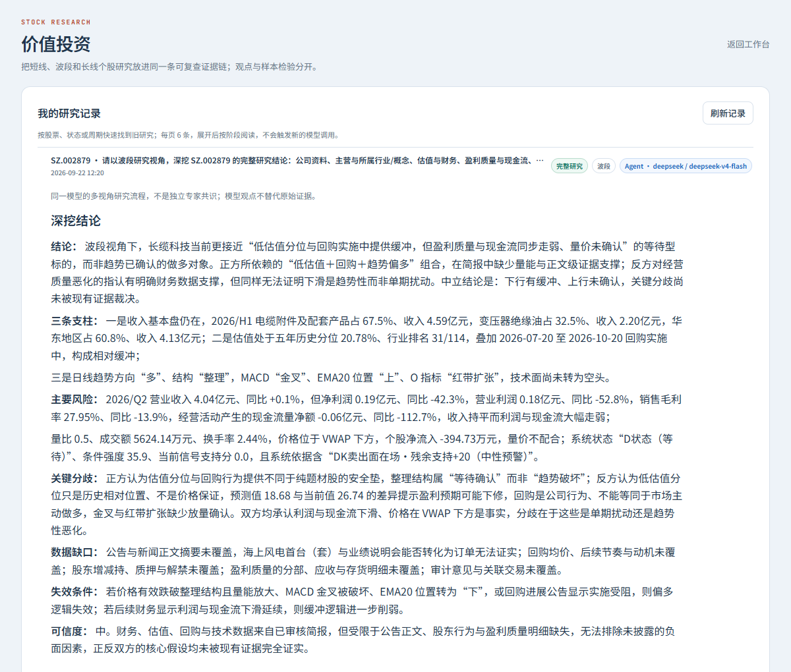

# 选股与个股研究｜从一句想法走到可核对的结论

[作品首页](../../README.md) · [市场发现](市场发现.md) · [指标机器人](指标机器人.md) · [AI 助手](AI助手.md)

这组能力承接“我发现一个方向”之后的研究：**智能选股**把可重复的条件先筛出来；**个股研究**把公司、财务、行业、技术和反方风险放进同一条证据链；**PEG 估值**只在输入可靠时计算；**历史研究**把当时的命题与事后结果分开保存。四个入口并不互相代替，尤其 AI 给出的候选仍要经过字段审核和确定性扫描。

| 步骤 | 页面 | 用户得到什么 |
| --- | --- | --- |
| 形成范围 | [智能选股](#screener) | 被解释过、可复核的筛选条件与候选池 |
| 核对单股 | [个股研究](#stock-research) | 事实、支持证据、反证与风险 |
| 估值辅助 | [PEG](#peg) | 价格、预期盈利和增长的适用性检查 |
| 保存判断 | [历史研究](#history) | 命题、规则、日期与事后记录 |

## 智能选股｜口语输入，条件必须先过审

用户可以从经典策略开始，也可以描述“近期放量、行业里较强，但不要追得太高”。AI 的作用是把口语拆成平台允许的字段和候选阈值，并指出“近期”“较强”等词的歧义。页面列出解析结果，让用户逐条确认；只有通过字段白名单、数据覆盖和条件检查后，确定性筛选器才开始扫描。

条件可选择“全部满足”或“任一满足”，候选范围可限制为当日榜单、市场或板块。结果说明命中哪条、哪条未覆盖，不把模型直接写出的股票名称冒充扫描结果。条件与策略可以保存，再送到[机器人](指标机器人.md)和[回测中心](验证与账户.md#backtest)。

技术上，FastAPI 处理解析路由与条件验证，账号状态限制模型来源；筛选引擎负责真实行情字段和布尔组合，前端把“描述—复核—扫描—结果”拆成连续步骤。

## 个股研究｜先有事实，再写支持与反对

进入某只股票后，研究页把公司业务、所属行业、收入与利润、现金流、估值、技术位置、公告催化和反方风险分开呈现。简单问题可以直接解释已取得的事实；需要完整深挖时进入阶段任务，分别检查题材、资金、技术、财务与证据缺口。结论旁保留交易日、资料来源和未覆盖项。

这里的重点不是让 AI“说服”用户，而是把主张写成可被检验的命题。例如：某项订单是否真的落在公司公告中、现金流是否支持利润增长、估值优势是否只是历史低位。用户从结论可以返回原文与数值，再把关键条件带到[历史验证](#history)。

后端先封存行情、财务与资料事实，服务端 Agent 按阶段读取有界事实包；前端呈现进度、失败状态和归档，不为显示一张漂亮卡片重新调用模型。

## PEG 估值｜能算之前先问“数据够不够”

PEG 将前瞻市盈率与盈利增长率放在一起，只是估值辅助，不单独给出“便宜”或“应买”的结论。页面先检查现价、同一预测年度的一致预期 EPS、年度利润与增长区间；字段不齐或公司亏损时显示不适用，不从研报标题和普通说明表猜出预测值。

有效数据会展示计算关系、采用的年份和来源数量。用户再判断行业周期、预测可信度与盈利质量，并可点击[个股研究](#stock-research)补充业务证据。数值计算与字段校验在业务层完成，AI 只解释结果和局限。

[机构预期与年度利润局部图](../new_screenshots/SHOT-034-b.png)与上图对应，显示两家机构预期及增长数据的来源边界。

## 历史研究｜保留当时的判断，不用结果改写过程

历史研究把对象、命题、规则、观察日与实际结果关联起来。可用龙虎机位等原始资料做盲测：先登记当时能看到的信息，再回看之后的市场表现。报告、回测和质量统计作为验证材料，不将后来才出现的数据写回过去的决策。

记录可以继续进入[复盘中心的明日验证](复盘中心.md#tomorrow)和[回测](验证与账户.md#backtest)。这个页面的价值是把“当时为何这样想、结果是否支持、哪里判断错了”留成可复核档案。

下一步：[查资料与研报](资讯与研报.md) · [做回测与信号质量核对](验证与账户.md) · [返回作品导览](../作品导览.md)。
